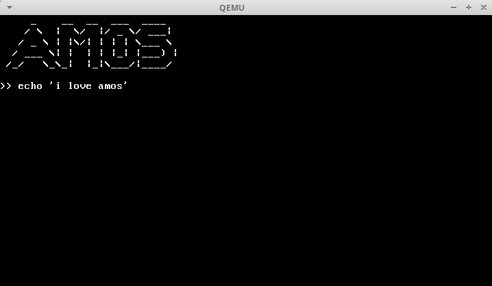

# AMOS

<!--
<html>
<head>

</head>
<body>
-->

    

    <a href="#installation">Installation</a> •
    <a href="#usage">Usage</a> •
    <a href="#features">Features</a> •
    <a href="#to-do">To-Do</a> •
    <a href="#license">License</a>

    AMOS Is a UNIX Based Operating System written from scratch using C. This project was made by 
    the two of us in order to learn more about OS development, thus it is quite simple code wise.

<h2 style="text-align:center" id="Installation">Installation</h2>

    Firstly, download the code from the git repository, then run <code>installations.sh</code>.
    This will download everything needed to run the project.
    

    After that, simply open a new terminal inside the project's folder and execute the makefile using this command: <code>make run</code>.
    This will also generate an ISO file of the OS.

<h2 style="text-align:center" id="Usage">Usage</h2>

    Our console supports a number of functions, simply write the command of the function
    you want to execute and press enter afterwards:
    <ul type="circle">
    <li><code>help</code> - Help Function</li>
    <li><code>exit</code> - Exit the OS</li>
    <li><code>task</code> - Execute our simple Multi Processing Code, which will run 3 different tasks</li>
    <li><code>stop</code> - Stop the Multi Processing execution</li>
    <li><code>clear</code> - Clears the console</li>
    <li><code>usermode</code> - Switches to usermode (Currently you can't do anything while in usermode)</li>
    <li><code>run (file name)</code> - Runs our stack based interpreter</li>
    <li><code>graphic</code> - Switches to graphic mode (Which lets you to move the mouse cursor around and move a square around</li>
    <li><code>ls</code>Print all available files on the disk</li>
    <li><code>cat (file name)</code> - Print the contents of a file</li>
    <li><code>touch (file name)</code> - Create a new txt file</li>
    <li><code>write (file name) (data)</code> - Write data into a file</li>
    <li><code>time</code> - Show the current time</li>
</ul>

<h2 style="text-align:center" id="Features">Features</h2>

 Implementation of Process's File System  
 Stack Based Interpreter  
 Implementation of USTAR  
 Simple Mouse Driver  
 Simple Speakers Driver  
 Simple Multi Processing (including UserMode)  
 Simple Clock  
 Simple Graphic Mode   
 Main Terminal Which Supports Various Functions  

<h2 style="text-align:center" id="To-Do">To-Do</h2>

    <ul type="circle">
    <li>Add USB Support </li>
    </ul>

<h2 style="text-align:center" id="License">License</h2>

        Licensed under the [GNU General Public License v3.0](LICENSE)

</body>
